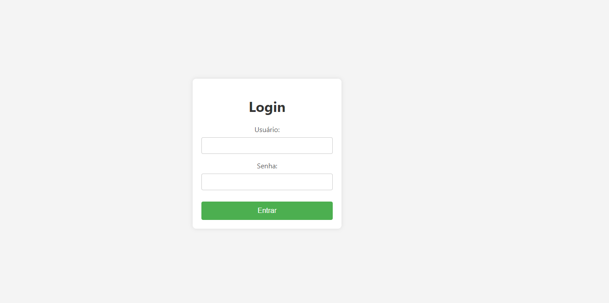
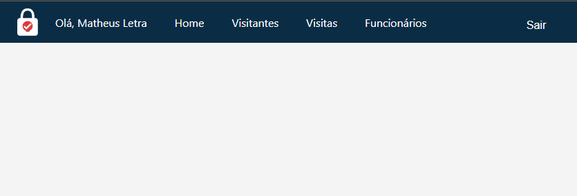
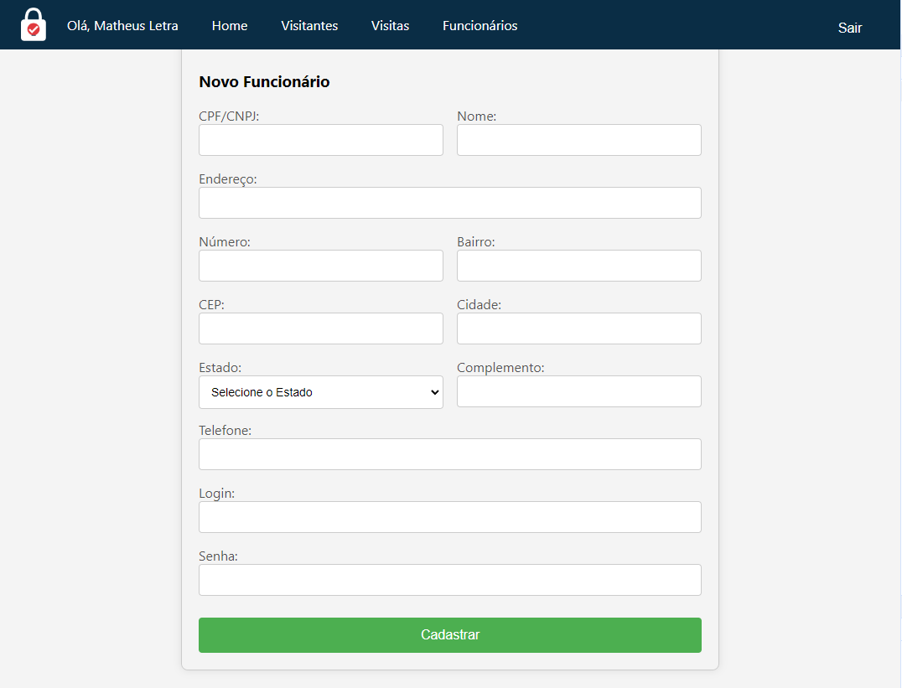

# Visit Control System

This project contains the backend and frontend applications of a visit management system

# Running 

- Configure the MySQL database on the `API/src/config/bancodados.js` folder

- On the API folder run `npm install` and `npm start` commands
  
- On the APP folder run `npm install` and `npm run dev` commands

## Project Screenshots

  <figure style="text-align:center; flex:1;">
    
  </figure>
  <figure style="text-align:center; flex:1;">
      
  </figure>
  <figure style="text-align:center; flex:1;">
      
  </figure>

